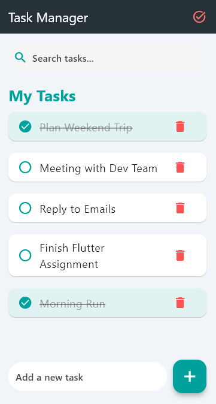

# To-Do Task Manager App

A modern, stylish, and user-friendly **To-Do Task Manager** application built with Flutter. This app allows users to manage their daily tasks efficiently with enhanced UI components, a unique color scheme, and intuitive features.

---

## Features ✨

- **Task Management:** Add, delete, and mark tasks as completed.
- **Search Functionality:** Quickly search through tasks.
- **Modern UI:** Stylish, gradient-based UI with a clean layout.
- **Persistent Task List:** Demonstrates how to manage tasks dynamically in-memory.
- **Customizable Theme:** Uses a unique teal-orange color scheme.

---

## Project Structure 📁

The app is organized as follows:

```plaintext
lib/
├── main.dart                  # Entry point of the app
├── constants/
│   └── style.dart             # Contains app-wide color schemes and styles
├── models/
│   └── task.dart              # Task model for managing to-do items
├── screens/
│   └── dashboard.dart         # Main screen containing task management UI
├── widgets/
│   └── task_item.dart         # Widget to display individual task items
└── assets/
    └── images/               # Add app images here (e.g., icons, logos)
```

---

## Setup Instructions 🛠️

Follow these steps to run the project on your local machine:

### Prerequisites

- **Flutter SDK**: Ensure Flutter is installed. Check with:
  ```bash
  flutter --version
  ```
- **Code Editor**: [Visual Studio Code](https://code.visualstudio.com/) or [Android Studio](https://developer.android.com/studio).
- **Device/Emulator**: Set up an Android Emulator, iOS Simulator, or a physical device.

---

### Installation Steps

1. **Clone the Repository**
   ```bash
   git clone <repository-link>
   cd todo-task-manager
   ```

2. **Get Dependencies**
   ```bash
   flutter pub get
   ```

3. **Run the App**
   Launch the app in debug mode:
   ```bash
   flutter run
   ```
   The app will start on your connected device/emulator.

---

## Design Notes 🎨

The app follows a **clean, modern design** with the following:

- **Color Palette:**
  - **Primary Colors**: Teal (`0xFF00897B`) and Orange (`0xFFF9A825`)
  - **Background**: Light Grey (`0xFFF5F5F5`)
  - **Text**: Dark Grey (`0xFF333333`)

- **Typography:**
  - Headers: Bold and large fonts
  - Subtext: Subtle grey text with smaller size

- **Widgets Used:**
  - `ListView` for displaying tasks
  - `TextField` with rounded edges for task input
  - `ElevatedButton` with gradient background
  - `Icons` for actions (Add, Delete, Complete)

---

## Screenshots 🖼️

| Dashboard Screen            |
|-----------------------------|
|  |

---

## Future Improvements 🚀

- **Persistent Storage:** Implement local storage (e.g., `shared_preferences` or SQLite) to save tasks.
- **Task Categories:** Allow grouping tasks into different categories.
- **Reminders/Notifications:** Add task reminders using Flutter notifications.
- **Theming:** Support dark mode.

---

## Contributing 🤝

Contributions are welcome! Follow these steps:

1. Fork the repository.
2. Create a new branch: `git checkout -b feature-branch`.
3. Commit changes: `git commit -m "Add new feature"`.
4. Push to the branch: `git push origin feature-branch`.
5. Submit a pull request.

---

## License 📜

This project is licensed under the MIT License. See the [LICENSE](LICENSE) file for more details.

---

## Author 👨‍💻

**Mohammed Nabil Abubakar**  
A passionate Full-Stack developer 🚀  
